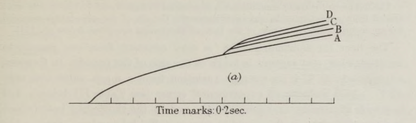

# hill-biomechanics-simulations
 \
In 1938, A.V. Hill [described mathematically the behavior of excess heat production during isometric muscle contractions in the frog sartorius muscle](https://royalsocietypublishing.org/doi/pdf/10.1098/rspb.1938.0050) . In this computational model, we follow the procedures outlined by Hill to conduct 12 simulated experiments of heat produced during isometric contractions with varied shortening distances and varied shortening loads.

## Requirements
- MATLAB 
- The hill.p file (This is a black-box function containing parameters controlling the responses of a contractile element and an elastic element. The complex visco-elastic properties of muscle tissue and their parameters are simulated using this function.)

## Pipeline

#### 0. Ensure that the hill.p file is in the same directory as the hill_experiments.m

#### 1. Replicate heat trace measurements of isometric contraction 
  * In every simulation, the maximal heat produced during reaches an equilibrium. However, the heat traces in the second experiment (varied shortening loads) require varied times to reach equilibrium.
  * Varied shortening distances experiment (Hill Fig 7A)
  *  
  * Varied shortening loads (Hill Fig 7B)
  *  
    
#### 2. Visualize load response of the hill.p system for figures 7A and 7B
  * The contractile element in the hill.p function can only shorten when the the elastic component becomes elongated, owing to the attenuating behavior as the system regains equilibrium.
  * 

#### 3a. Extract 'Hill constants' ***a*** and ***b*** by heat-distance data fit
  * By simulating these data we are able to describe a relationship between excess heat produced and distance shortened, as well as between rate of excess energy liberated and load applied. By fitting the recordings of each simulated experiment, we obtain a set of constants, ***a*** and ***b***, as well as ****Po*** (maximal isometric tension) and ***Vmax*** (maximal shortening velocity).
  * 
  * The fit of excess heat vs distance shortened results in Hill's constant ***a***. The fit of rate of excess energy liberated vs load results in Hill's constant ***b***. Note that the Hill's constant ***b*** has a negative value.
  * 

#### 3b. Extract 'Hill constants' ***a*** and ***b*** by force-velocity data fit
  * By using the curve fitting tool (cftool), values of ***a*** and ***b*** are achieved without heat data by applying the relationship between force and velocity to the second experiment data (varied shortening loads).
  * The best algorithm used to fit this data was the Levenberg-Marquardt algorithm. ***Vmax*** was calculated by the equation ***Po * b / a***.
  * 

## Output:
  * The values of Hill's constants ***a*** and ***b*** were calculated by this computational model with a high degree of accuracy (<1% error). The target values were 37.0 for Hill's constant ***a*** and -0.38 for Hill's constant ***b***). 

## Acknowledgements
* Musculoskeletal System Module, Computational Modeling of Physiological Systems (BMENE6003), Biomedical Engineering Department, School of Engineering and Applied Science, Columbia University, New York, NY
